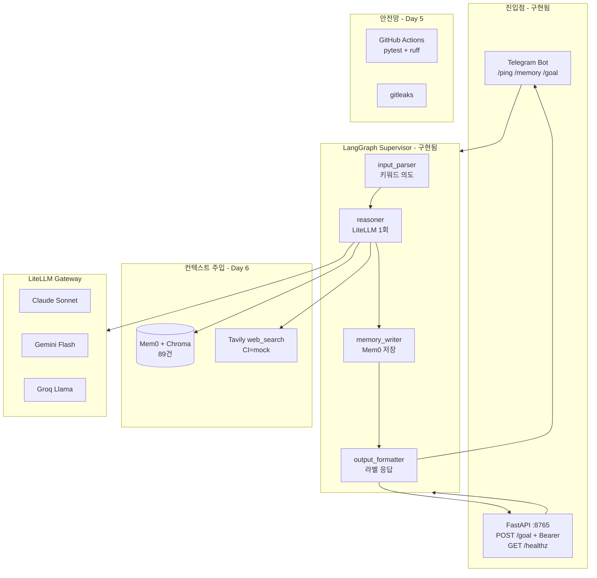
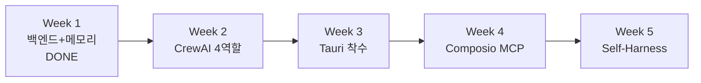

# 도깨비 OS 2.0 아키텍처 (현재 + 로드맵)

> SHARED_BRAIN `dokkebi_os_2_planning` 기준. **Week 1~Day 6 구현 반영**, Week 2~5는 DoD 수준.

## 전체 플로 (현재 동작)

## 5주 로드맵 (미구현 = 점선)

## Week 2 이후 (설계만, 코드 없음)

| 구간 | 내용 | 상태 |
|------|------|------|
| CrewAI 토론 | 장인/심판자/검사관/재판장 | 미착수 |
| Tauri UI | CopilotKit + React | Week 3 |
| Composio | MCP 통합 | Week 4 |
| Self-Harness | KPI + NAS cron | Week 5 |

## 무엇이 **아직** 그려지지 않았나

- CrewAI 노드별 프롬프트·토론 루프 상세 시퀀스
- Tauri 화면 와이어프레임
- Self-Harness KPI 5개 정의
- ~~FastAPI 인증~~ → `GOAL_API_TOKEN` Bearer / `X-API-Key` (설정 시만)

이 문서가 **현 시점의 공식 플로차트**입니다. Claude 없이 Cursor가 Week 2부터 이어갈 수 있습니다.
